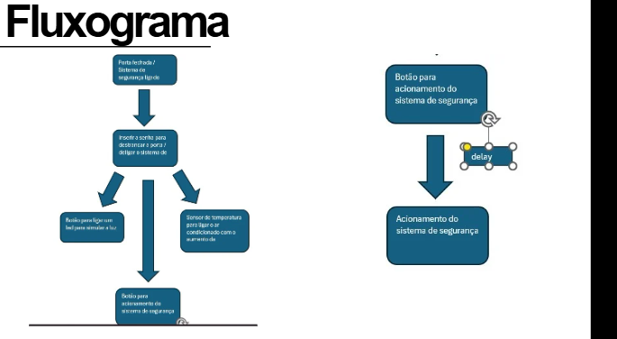
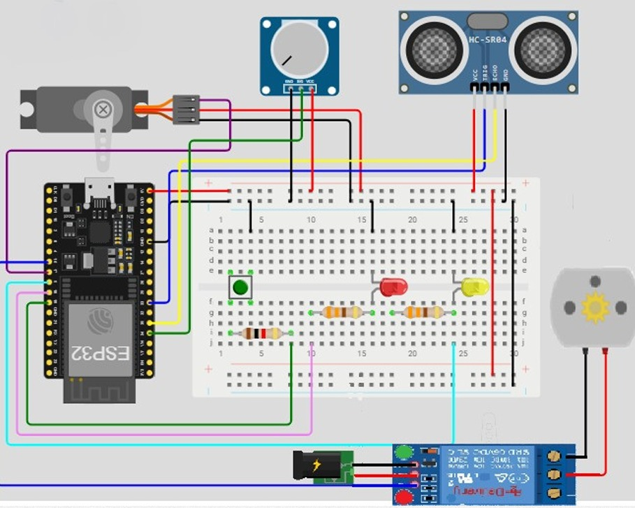
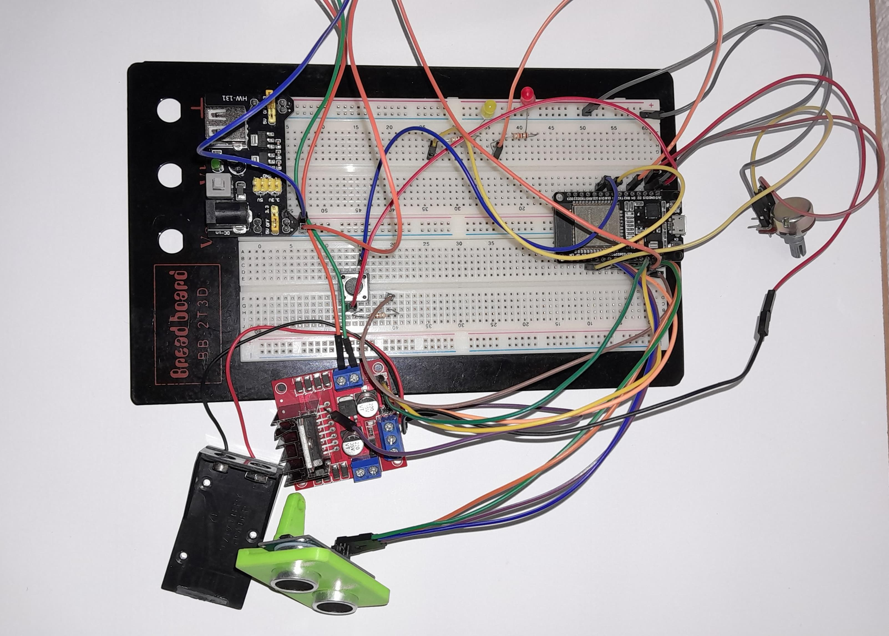

# ECOP11A - Projeto Final Introdução a Engenharia

**Introdução a Programação: Projeto Final com Introdução a Engenharia e Métodos Científicos**

## Equipe
- João André Fagundes Pinto (2025001852)
- Leonardo Toledo Alves Costa (2025010842)
- Felipe Pellizzari Teixeira (2025001610)
- Renan Rangel da Silva
- Igor
- Saniele

## Tema do Projeto

O projeto consiste no desenvolvimento de um **Sistema Inteligente de Automação Residencial** baseado em ESP32, que integra múltiplos sensores e atuadores para proporcionar segurança e controle de conforto térmico de forma automatizada. 

O sistema funciona através de uma interface de autenticação por senha, onde um sensor ultrassônico acoplado a um servo motor simula uma câmera de segurança com movimento de varredura. Em caso de falha na autenticação, o sistema aciona um alarme de segurança. Quando o acesso é validado corretamente, o sistema ativa automaticamente a iluminação ambiente e o sistema de climatização através de relés, sendo a temperatura do ar-condicionado ajustável via potenciômetro.

Toda a lógica de controle é processada pelo microcontrolador ESP32, oferecendo uma solução de automação residencial prática, eficiente e com potencial de escalabilidade para futuras expansões.

## Fase 1: Pesquisa e Planejamento

### Problema

A falta de sistemas de automação residencial acessíveis e integrados representa um desafio para muitas residências, que carecem de soluções eficientes para:
- **Segurança inadequada**: Ausência de sistemas de monitoramento e controle de acesso automatizados
- **Ineficiência energética**: Falta de controle inteligente de iluminação e climatização
- **Conforto limitado**: Necessidade de intervenção manual constante para ajustes de temperatura e iluminação
- **Custo elevado**: Sistemas comerciais de automação residencial com preços inacessíveis para a maioria das famílias

### Objetivo

Desenvolver um **sistema de automação residencial inteligente e de baixo custo** utilizando ESP32, com os seguintes objetivos específicos:

**Objetivo Geral:**
Criar uma solução integrada de automação que combine segurança e conforto térmico de forma autônoma e eficiente.

**Objetivos Específicos:**
- Implementar um sistema de controle de acesso por senha com feedback visual através de simulação de câmera
- Automatizar o controle de iluminação residencial baseado na autenticação do usuário
- Desenvolver controle inteligente de climatização com ajuste manual de temperatura
- Integrar sistema de alarme para situações de falha na autenticação
- Demonstrar a viabilidade técnica e econômica de soluções IoT para automação residencial

### Sensores e Atuadores

**Sensores:**
- **Sensor Ultrassônico HC-SR04**: Detecção de presença e simulação de sistema de monitoramento
- **Potenciômetro**: Controle manual da temperatura do sistema de climatização
- **Interface de entrada (teclado/botões)**: Captura da senha de acesso ao sistema

**Atuadores:**
- **Servo Motor SG90**: Movimento de varredura para simulação de câmera de segurança
- **Módulo Relé**: Controle de acionamento da iluminação e sistema de ar-condicionado
- **LEDs**: Indicação visual do status do sistema (autenticado/não autenticado)
- **Buzzer/Alto-falante**: Sistema de alarme sonoro para falhas de autenticação

**Controlador Principal:**
- **ESP32**: Microcontrolador responsável pelo processamento da lógica de controle, interface com sensores/atuadores e tomada de decisões do sistema

### Fluxograma

## Fase 2: Implementação

### Diagrama Esquemático

## Fase 3: Documentação e Apresentação

### Fotos do Protótipo

### Apresentação de Slides
[Apresentação](https://www.canva.com/design/DAGrL0_3H8Y/5wbdBqv5nkYjR6DFNuIOcw/edit?utm_content=DAGrL0_3H8Y&utm_campaign=designshare&utm_medium=link2&utm_source=sharebutton)